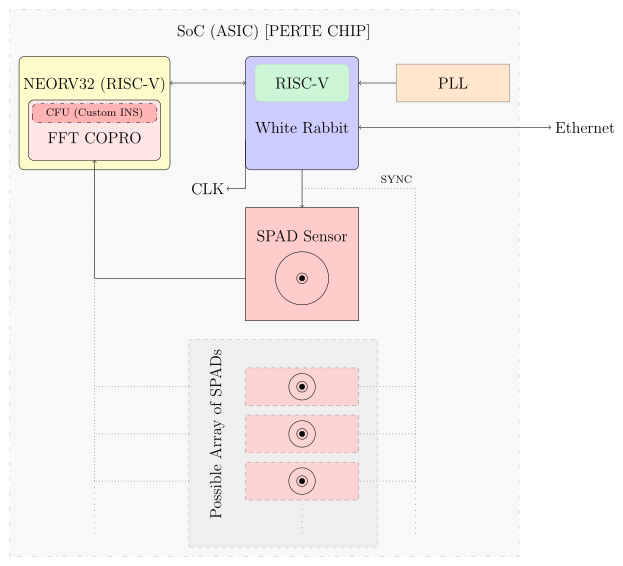
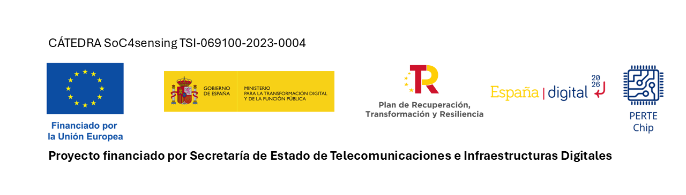

# [Unike267](https://github.com/Unike267) Thesis

- **University**: UPV/EHU.
- **Doctoral Programme**: Engineering Physics.
- **Department**: Electronics Technology.
- **Group**: Digital Electronics Design Group, GDED (GIU21/007).
- **PhD Student**: Unai Sainz-Estebanez.

---

## Abstract

Repository to store some stuffs of my thesis.

## GOAL

To perform this ASIC:

  

---

This work was partially supported by Union Europea-NextGenerationEU through the Cátedras Chip program SOC4SENSING TSI-069100-2023-0004.

  

