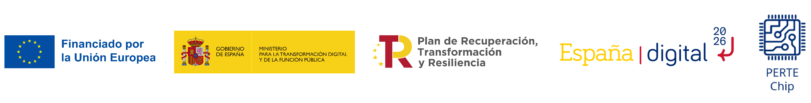

# [Unike267](https://github.com/Unike267) Thesis

- **University**: UPV/EHU.
- **Doctoral Programme**: Engineering Physics.
- **Department**: Electronics Technology.
- **Group**: Digital Electronics Design Group, GDED (GIU21/007).
- **PhD Student**: Unai Sainz-Estebanez.

---

## Important clarification ❗

This repository is a public **incomplete** mirror of my official thesis repository, which is hosted privately on GitLab. 

In other words, the information in this repository will be kept up to date relative to the private repository but **will not contain all the content.**

## Abstract

Repository to store some stuffs of my thesis.

## Initial Research document

Document that includes information regarding the concepts of the thesis. 
Initial approach.

This document is generated in CI (Continuous Integration) through the following container:

- `ghcr.io/unike267/containers/latex-pygments:latest`

The generated PDF file is available in [releases](https://github.com/Unike267/Thesis/releases). 

In addition to this, this file is available in the repository [actions](https://github.com/Unike267/Thesis/actions). 

- Workflow: `docs` 

- Artifact name: `INITIAL_RESEARCH_DOC`

## Simulations

Currently, only the module named `serial_dac856x` is being simulated in CI using my custom VUnit testbench based on the test `serial_dac856x_tb.vhd`, which is located in `/wr-cores/testbench/dac/`.

Both the generated waveform and the CSV results from the CI execution of the testbench are uploaded as artifacts in the `Simulation` workflow (Job `DAC_serial_dac856x`). 
These files are also attached to the assets of the [releases](https://github.com/Unike267/Thesis/releases) starting from version `v0.2`, with the names `wave_dac.vcd` and `tb_dac.csv`.

Due to the fact that a few WRPC modules, such as [urv-core](https://gitlab.com/ohwr/project/urv-core) or [lm32](https://gitlab.com/ohwr/project/general-cores/-/tree/master/modules/wishbone/wb_lm32), are written in Verilog, and most of the testbench top modules (located in `/wr-cores/testbench`) are in SystemVerilog, I can't run the WRPC simulation in this repository's CI at the moment.
This is because there is no free/libre mixed-language simulator available. 
As a result, I can't easily set up continuous integration with a generic GitHub runner. 
To perform the simulation, for example, using Questasim, I would need to configure a custom runner. 
However, this custom set-up is already deployed in my private GitLab repository, see [#3](https://github.com/Unike267/Thesis/issues/3).

To see how I simulated [`WRPC-v.4.2`](https://gitlab.com/ohwr/project/wr-cores/-/tree/wrpc-v4.2) locally, see [#2](https://github.com/Unike267/Thesis/issues/2).

## Implementation

We are beginning the first practical tests on the board.

- [cute_a7](https://ohwr.org/projects/cute-wr-a7/)
  - [gl:cute-wr-a7](https://gitlab.com/ohwr/project/cute-wr-a7)
  - Manufacturated by Sync (Beijing) Technology [Cute-WR-A7/50T](http://www.synctechnology.cn/EN_detaile.aspx?id=39)
 
## GOAL

To perform this ASIC:

  

---

This work was partially supported by Union Europea-NextGenerationEU through the Cátedras Chip program SOC4SENSING TSI-069100-2023-0004.

  

